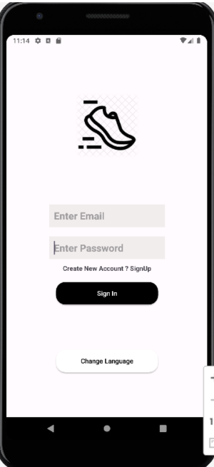
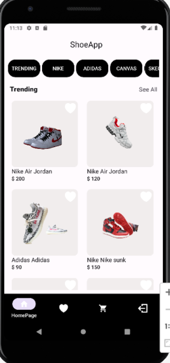
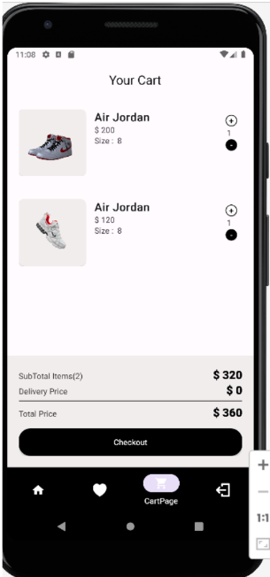
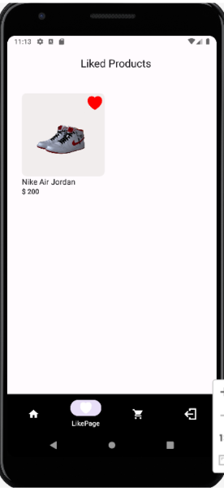

# Shoe App

Welcome to the Shoe App! This Kotlin application allows users to explore a wide range of shoes from various brands, search for shoes by categories such as brand name, like their favorite products, write specific notes, select sizes, place orders, view order history, and translate the app into their preferred language.

## Features

- **Browse All Brand Shoes**: Users can explore shoes from different brands.
- **Search by Categories**: Search for shoes based on specific categories like brand name.
- **Like Products**: Users can like products to save them for later viewing.
- **Take Notes**: Write specific notes for each shoe.
- **Select Sizes**: View available sizes for selected shoes and choose the desired size for ordering.
- **Place Orders**: Users can place orders for selected shoes.
- **View Order History**: Check the order history and total cost in the checkout screen.
- **Translation**: Translate the app into any preferred language.
- **Responsive Design**: The app is responsive to any screen size.
- **Persistence**: Application state and changes are preserved even after the application is closed and reopened.

## Technologies Used

- **Kotlin**: Programming language used for developing the Android application.

- **SQL**: Used for storing and retrieving notes.

- **Firebase Authentication (Fireauth)**: Integrated for user authentication.

- **RESTFul APIs**: Utilized for fetching product data.

## Installation

To run the application, follow these steps:

1. Integrate Firebase Authentication (Fireauth) with the application.
2. Run the Kotlin application.

## Screenshots

            
    

            
    

            

## License

This project is licensed under the [MIT License](LICENSE).

## Support

For any inquiries or support, please contact [dhyey870@gmail.com](mailto:dhyey870@gmail.com).
